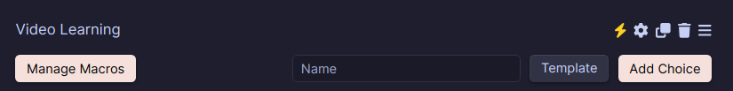
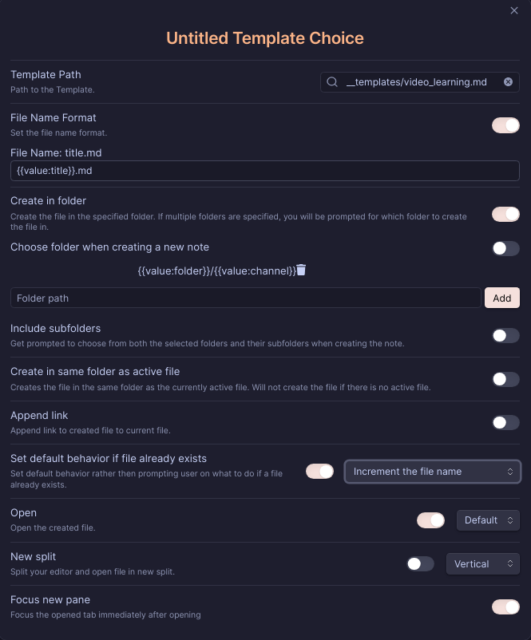

# 📝 obsidian-video-notes

🚀 A powerful tool for taking structured notes on YouTube videos directly in Obsidian withoud API.

## 📥 Set up

1. Make sure that you have the [QuickAdd](obsidian://show-plugin?id=quickadd) plugins installed.
2. Make sure that the plugins are enabled.
3. Put the JS script in the `__scripts` folder, if it doesn't exist, create it in the root of your vault.
4. Open the QuickAdd settings and press "Manage Macros", imagine a new macro name and press "Add Macro".
5. Close the "Manage Macros" window and change "Template" button in the QuickAdd settings to "Macro".
6. In the "Macro" field, type the name of the macro you created in step 4 and press "Add choice".
7. Press on the "⚡️".
   
8. Your choice will appear in the QuickAdd menu. Press configure button of the your choice.
9. In "choice" configure menu select your macro and press second settings button.
10. Now in the action settings menu of your "choice":
    1. In `User Scripts` field type filename of the script from step 3 and press "Add".
    2. Press `Template`, you will have a template, press configure button and set the same settings as in the screenshot below.
    3. ⚠️ Make sure you use your template path.
    4. Close all settings.
11. Copy template from the `template.md` file to the `your template dir` folder in the root of your vault.
12. Call Command Pallete with CTRL+P and type `QuickAdd: <your choice name from step 4>` and press Enter.
13. Follow the on-screen instructions.
14. Enjoy!

## 🤝 Contributing

1. Fork the repository.
2. Create a feature branch (`git checkout -b feature/amazing-feature`).
3. Commit your changes (`git commit -m 'Add some amazing feature'`).
4. Push to the branch (`git push origin feature/amazing-feature`).
5. Create a Pull Request.

## 👥 Authors

Michael (<x30827pos@gmail.com>)

---

## 🙏 Acknowledgments

Thanks to the ([shahzeb1](https://github.com/shahzeb1)) developer of [obsidian-youtube-notes](https://github.com/shahzeb1/obsidian-youtube-notes) for the inspiration.

## 📄 License

This project is licensed under the MIT License. See the [LICENSE](LICENSE) file for details.
